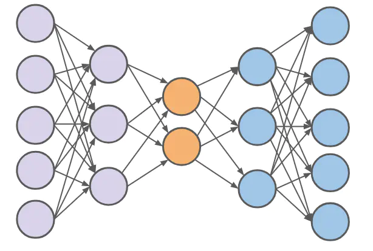
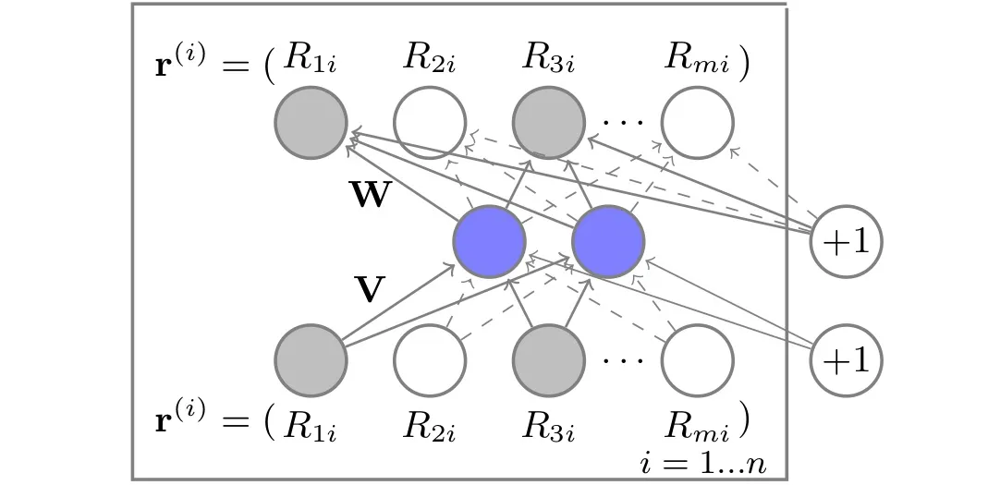

# AutoRec 学习笔记

AutoRec[^1]是传统推荐算法到深度推荐算法的过渡模型之一，思路上将**自编码器(AutoEncoder)** 和 **协同过滤(Collaborative Filter)** 相结合，仅通过**单隐层神经网络**实现推荐任务。

## AutoRec基本原理
自编码器是一种无监督学习神经网络，将$n$维输入向量压缩(encode)为$m$维后又解压(decode)为$n$维向量输出，从中学习输入数据的隐含特征。

而在AutoRec模型中，仅使用最简单的自编码器，通过一层隐含层拟合**共现矩阵**的item向量，替换原有的共现矩阵，进行item相似度的计算。

其中$r^{(i)}$为共现矩阵中物品$i$与$m$名用户的评分向量。该模型的表达式为
$$h(r;\theta)=f(W\cdot g(Vr+\mu)+b)$$
$V$和$W$为输入层与输出层的权重矩阵，$\mu$和$b$为偏置，$f$和$g$为激活函数。
加入正则化参数后，AutoRec的损失函数可以表示为
$$min_{\theta}\sum_{i=1}^{n}{\parallel r^{(i)}-h(r^{(i)};\theta)\parallel_{O}^{2}}+\frac{\lambda}{2}(\parallel W\parallel_{F}^{2}+\parallel V\parallel_{F}^{2})$$

## AutoRec模型推荐过程
1. 输入由用户id、物品id、评分组成的共现矩阵。
2. 提取出物品$i$对应的向量$r^{(i)}$，通过AutoEncoder返回$h(r^{(i)};\theta)$。
3. 计算损失函数，梯度下降反向传播更新参数，拟合所有的$r^{(i)}$更新共现矩阵。
4. 选择用户$j$，此时$j$在共现矩阵中的评分向量为经过AutoEncoder拟合后的预测评分。经过排序可以得到对应的物品推荐列表。

## 思考
该模型中对于缺失的评分数据处理有所不当，仅仅是把缺失的评分设置为0，那么该如何与存在的低评分进行区分呢？对所有未经过评分的物品得到的预测评分都将趋近于0，这没有什么意义。[^2]

[^1]:[Sedhain, S., Menon, A. K., Sanner, S., & Xie, L. (2015). AutoRec: Autoencoders Meet Collaborative Filtering. the web conference.](https://users.cecs.anu.edu.au/~akmenon/papers/autorec/autorec-paper.pdf)
[^2]:[最小推荐系统：AutoRec](https://zhuanlan.zhihu.com/p/159087297)
[^3]:[推荐系统之AutoRec模型原理以及代码实践](https://www.jianshu.com/p/e8a2e4073e41)