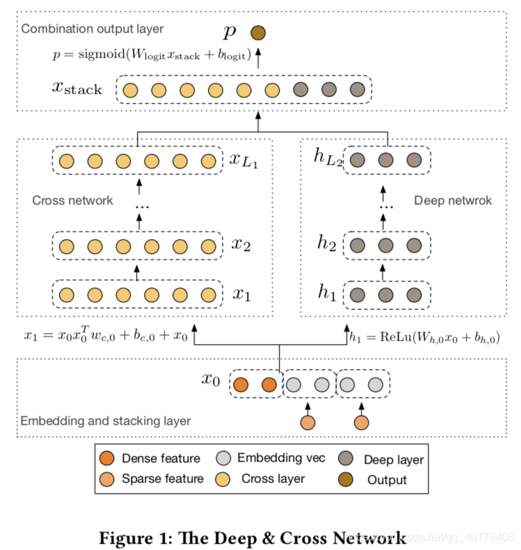
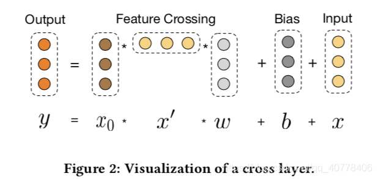

# DCN 学习笔记

DCN(Deep&Cross Network)是基于Wide&Deep推出的模型，其中把Wide层用Cross层替代，实现了特征间的交叉编码。与DeepFM和PNN中特征域之间的特征交叉不同，在DCN中所有特征Embedding向量的concat结果在每一位上都进行交叉。



**Cross层**


其中 $x_0$ 为特征Embedding后concat的向量，在每一层cross层都参与特征的交叉，而后又将交叉的结果作为输入传入下一层cross层。当经过L层cross层可以看作特征经过了L+1阶的交叉。

在上图的式子中，可以优先进行 $ x^{'}*w$ 的计算得到一个数值，后再将该数值与向量 $x_0$ 做数乘，可以减少计算时间。

## Pytorch 实现

**Embedding层**

```python
class FeaturesEmbedding(torch.nn.Module):

    def __init__(self, field_dims, embed_dim):
        super().__init__()
        self.embedding = torch.nn.Embedding(sum(field_dims), embed_dim)
        self.offsets = np.array((0, *np.cumsum(field_dims)[:-1]), dtype=np.compat.long)
        # 服从均匀分布的初始化器，input必须为 tensor.float64
        torch.nn.init.xavier_uniform_(self.embedding.weight.data)

    def forward(self, x):
        """
        :param x: Long tensor of size ``(batch_size, num_fields)``
        """
        x = x + x.new_tensor(self.offsets).unsqueeze(0)
        return self.embedding(x)
```

**Cross层**

```python
class CrossNetwork(torch.nn.Module):

    def __init__(self, input_dim, num_layers):
        super().__init__()
        self.num_layers = num_layers
        self.w = torch.nn.ModuleList([
            torch.nn.Linear(input_dim, 1, bias=False) for _ in range(num_layers)
        ])
        self.b = torch.nn.ParameterList([
            torch.nn.Parameter(torch.zeros((input_dim,))) for _ in range(num_layers)
        ])

    def forward(self, x):
        """
        :param x: Float tensor of size ``(batch_size, num_fields, embed_dim)``
        """
        x0 = x
        for i in range(self.num_layers):
            # x*x^T*w + b = w*x * x + b
            xw = self.w[i](x)
            x = x0 * xw + self.b[i] + x
        return x
```

**Deep部分MLP层**

```python
class MultiLayerPerceptron(torch.nn.Module):

    def __init__(self, input_dim, hidden_dims, dropout, output_layer=True):
        """_summary_
        Args:
            input_dim (int): 输入层
            hidden_dims (list): 隐藏层
            dropout (float): dropout 的概率 p
            output_layer (bool, optional): 输出层是否维度为1. Defaults to True.
        """
        super().__init__()
        layers = list()
        for hidden_dim in hidden_dims:
            layers.append(torch.nn.Linear(input_dim, hidden_dim))
            layers.append(torch.nn.BatchNorm1d(hidden_dim))
            layers.append(torch.nn.ReLU())
            layers.append(torch.nn.Dropout(p=dropout))
            input_dim = hidden_dim
        if output_layer:
            layers.append(torch.nn.Linear(input_dim, 1))
        self.mlp = torch.nn.Sequential(*layers)

    def forward(self, x):
        """
        :param x: Float tensor of size ``(batch_size, embed_dim)``
        """
        return self.mlp(x)
```

**DCN模型**

```python
class DeepCrossNetworkModel(torch.nn.Module):
    """
    A pytorch implementation of Deep & Cross Network.

    Reference:
        R Wang, et al. Deep & Cross Network for Ad Click Predictions, 2017.
    """

    def __init__(self, field_dims, embed_dim, num_layers, mlp_dims, dropout):
        super().__init__()
        self.embedding = FeaturesEmbedding(field_dims, embed_dim)
        self.embed_output_dim = len(field_dims) * embed_dim
        self.cn = CrossNetwork(self.embed_output_dim, num_layers)
        self.mlp = MultiLayerPerceptron(self.embed_output_dim, mlp_dims, dropout, output_layer=False)
        self.linear = torch.nn.Linear(mlp_dims[-1] + self.embed_output_dim, 1)

    def forward(self, x):
        """
        :param x: Long tensor of size ``(batch_size, num_fields)``
        """
        embed_x = self.embedding(x).view(-1, self.embed_output_dim)
        x_l1 = self.cn(embed_x)
        h_l2 = self.mlp(embed_x)
        x_stack = torch.cat([x_l1, h_l2], dim=1)
        p = self.linear(x_stack)
        return torch.sigmoid(p.squeeze(1))
```