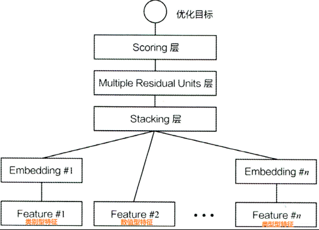
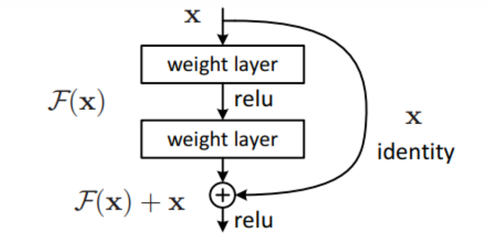

# DeepCrossing 学习笔记

DeepCrossing[^1]模型和FNN模型相似，也是将FM与深度学习框架相结合，不同之处在于DeepCrossing引入了残差网络，把原本FNN中MLP的所在位置用多层残差网络替换。而残差网络可以有效解决梯度消失和梯度爆炸的问题，在相同的层数下也比一般神经网络具有更快的收敛速度。



其中对于类别型特征Feature#1而言，通过one-hot encoding之后得到的特征向量非常系数，所以需要使用embedding转化为稠密型向量，而数值型特征Feature#2则可以直接加入stacking层。在stacking层后将特征向量结合并铺平，后续可以进入多层残差网络。Scoring层通常会增加sigmoid或softmax激活函数。

对于Multiple Residual层，其结构整体和多层感知机(MLP)相同，只是把其中的全连接层替换为残差块，在每个残差块后跟随激活函数与drop层。残差块的结构如下。



残差块将输入加入进输出，可以补充在不同神经元后出现的信息丢失，这时候网络结构的拟合目标变成了F(x)+x。

## Pytorch 实现
参考博客[^2]
**残差块**

```python
class Residual_block(torch.nn.Module):
    def __init__(self, hidden_unit, dim_stack):
        super(Residual_block, self).__init__()
        self.linear1 = torch.nn.Linear(dim_stack, hidden_unit)
        self.linear2 = torch.nn.Linear(hidden_unit, dim_stack)
        self.relu = torch.nn.ReLU()
    
    def forward(self, x):
        orig_x = x.clone()     # Returns a copy of input
        x = self.linear1(x)
        x = self.linear2(x)
        outputs = self.relu(x + orig_x)
        return outputs
```

**多层残差网络**

```python
class MultipleResidualUnits(torch.nn.Module):

    def __init__(self, input_dim, hidden_dims, dropout, output_layer=True):
        """_summary_
        Args:
            input_dim (int): 输入层
            hidden_dims (list): 隐藏层
            dropout (float): dropout 的概率 p
            output_layer (bool, optional): 输出层是否维度为1. Defaults to True.
        """
        super().__init__()
        layers = list()
        for hidden_dim in hidden_dims:
            layers.append(Residual_block(hidden_dim, input_dim))
            layers.append(torch.nn.Dropout(p=dropout))
        if output_layer:
            layers.append(torch.nn.Linear(input_dim, 1))
        self.mlp = torch.nn.Sequential(*layers)
    
    def forward(self, x):
        """
        :param x: Float tensor of size ``(batch_size, embed_dim)``
        """
        return self.mlp(x)
```

**Embedding层**

```python
class FeaturesEmbedding(torch.nn.Module):

    def __init__(self, field_dims, embed_dim):
        super().__init__()
        self.embedding = torch.nn.Embedding(sum(field_dims), embed_dim)
        self.offsets = np.array((0, *np.cumsum(field_dims)[:-1]), dtype=np.compat.long)
        # 服从均匀分布的初始化器，input必须为 tensor.float64
        torch.nn.init.xavier_uniform_(self.embedding.weight.data)

    def forward(self, x):
        """
        :param x: Long tensor of size ``(batch_size, num_fields)``
        """
        x = x + x.new_tensor(self.offsets).unsqueeze(0)
        return self.embedding(x)
```

**DeepCrossing模型**

```python
class DeepCrossingModel(torch.nn.Module):

    def __init__(self, field_dims, embed_dim, mlp_dims, dropout):
        super().__init__()
        self.embedding = FeaturesEmbedding(field_dims, embed_dim)
        self.embed_output_dim = len(field_dims) * embed_dim
        self.mlp = MultipleResidualUnits(self.embed_output_dim, mlp_dims, dropout)
    
    def forward(self, x):
        """
        :param x: Long tensor of size ``(batch_size, num_fields)``
        """
        embed_x = self.embedding(x)
        x = self.mlp(embed_x.view(-1, self.embed_output_dim))
        # 如果没有squeeze(1)，x的shape为 batch*1，是一个二维的tensor，sigmoid函数无法处理
        #经过x.squeeze(1)后，x的shape变为 batch, 是一个一维的tensor，那么sigmoid也会返回一维tensor
        return torch.sigmoid(x.squeeze(1))
```

[^1]:[Deep Crossing: Web-Scale Modeling without
Manually Crafted Combinatorial Features, 2016
](https://kdd.org/kdd2016/papers/files/adf0975-shanA.pdf)
[^2]:[Deep Crossing 经典的深度学习架构（Embedding+多层神经网络）模型（KDD 2016）](https://zhuanlan.zhihu.com/p/542677885)