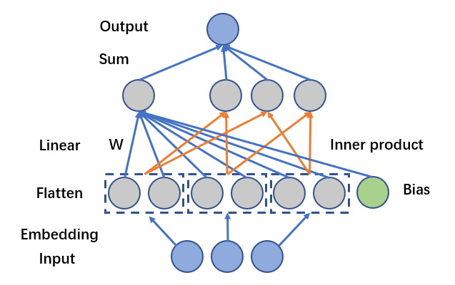

# FM 学习笔记

FM[^1](Factorization Machines)是一种可以实现特征交叉的模型，适合处理含有大规模稀疏特征的数据。从模型的演化上，可以将FM模型看作是MF(Matrix Factorization)与POLY2的结合。

## FM公式
$$\hat{y} = w_0 + \sum_{i=1}^{N}{w_ix_i} + \sum_{i=1}^{N}{\sum_{j=i+1}^{N}{<v_i\cdot v_j>x_ix_j}}$$
其中共有$N$个特征(包括用户特征与物品特征)，$x_i$表示为第$i$个特征，FM为每个特征$x_i$分配一个隐向量$v_i$，通过特征对应的隐向量两两内积实现特征交叉。而经过embedding后，每个$x_i$都为特征域中某一特征的01编码，那么特征交叉仅会发生在不同的特征域之间。


## FM公式计算化简[^3]
$$\begin{align*}
&\sum_{i=1}^{N}{\sum_{j=i+1}^{N}{<v_i\cdot v_j>x_ix_j}}\\
=& \frac{1}{2}\sum_{i=1}^{N}{\sum_{j=1}^{N}{<v_i\cdot v_j>x_ix_j}} - \frac{1}{2}\sum_{i=1}^{N}{<v_i\cdot v_i>x_ix_i}\\
=&\frac{1}{2}(\sum_{i=1}^{N}{\sum_{j=1}^{N}{\sum_{k=1}^{m}{v_{i,k}v_{j,k}x_ix_j}}}-\sum_{i=1}^{N}{\sum_{k=1}^{m}{v_{i,k}v_{j,k}x_ix_j}})\\
=&\frac{1}{2}(\sum_{k=1}^{m}{((\sum_{i=1}^{N}{v_{i,k}x_i})(\sum_{j=1}^{N}{v_{j,k}x_j})-\sum_{i=1}^{N}{v_i^2x_i^2})})\\
=&\frac{1}{2}(\sum_{k=1}^{m}{((\sum_{i=1}^{N}{v_{i,k}x_i})^2-\sum_{i=1}^{N}{v_i^2x_i^2})})\\
\end{align*}$$

其中$N$为特征的数量，$m$为embedding向量的长度，通过计算化简可以将时间复杂度由$O(n^2)$降低到$O(n)$，特别是在面对大量稀疏特征时可以节省计算时间。

## 代码实践
尝试使用Pytorch实现FM模型。
### 线性部分
在线性部分中，虽然和内积部分是共享embedding向量的，但是可以使用另外一个embedding层，返回其求和结果实现embedding特征的线性回归结果。
```python
class FeaturesLinear(torch.nn.Module):

    def __init__(self, field_dims, output_dim=1):
        """_summary_
            equals to (embedding layer + linear layer)
        Args:
            field_dims (list): example: [3, 5, 6] means the dim of each feature field
        """
        super().__init__()
        self.fc = torch.nn.Embedding(sum(field_dims), output_dim)
        self.bias = torch.nn.Parameter(torch.zeros((output_dim,)))
        # 每一个feature由dim产生的位移，比如 [3, 5, 6] 得到offset [0, 3, 8]
        self.offsets = np.array((0, *np.cumsum(field_dims)[:-1]), dtype=np.compat.long)

    def forward(self, x):
        """
        :param x: Long tensor of size ``(batch_size, num_fields)``
        """
        # 使得每一个feature 的index依次递增，避免有重复的index进入embedding
        x = x + x.new_tensor(self.offsets).unsqueeze(0)
        return torch.sum(self.fc(x), dim=1) + self.bias
```
### Embedding层
将一般特征转化为embedding向量，建立该层时需要输入各特征域的特征数量。
```python
class FeaturesEmbedding(torch.nn.Module):

    def __init__(self, field_dims, embed_dim):
        super().__init__()
        self.embedding = torch.nn.Embedding(sum(field_dims), embed_dim)
        self.offsets = np.array((0, *np.cumsum(field_dims)[:-1]), dtype=np.compat.long)
        # 服从均匀分布的初始化器，input必须为 tensor.float64
        torch.nn.init.xavier_uniform_(self.embedding.weight.data)

    def forward(self, x):
        """
        :param x: Long tensor of size ``(batch_size, num_fields)``
        """
        x = x + x.new_tensor(self.offsets).unsqueeze(0)
        return self.embedding(x)
```

### FM部分
```python
class FactorizationMachine(torch.nn.Module):

    def __init__(self, reduce_sum=True):
        super().__init__()
        self.reduce_sum = reduce_sum

    def forward(self, x):
        """
        :param x: Float tensor of size ``(batch_size, num_fields, embed_dim)``
        """
        # dim = 1，为特征向量与特征向量对应位置做运算
        square_of_sum = torch.sum(x, dim=1) ** 2 # 返回 batch * embed_dim
        sum_of_square = torch.sum(x ** 2, dim=1)
        ix = square_of_sum - sum_of_square
        if self.reduce_sum:
            # 如果不加 keepdim 会返回一个 size = batch 的一维向量
            # 加了 keepdim = True，返回一个 batch * 1 的2维向量
            ix = torch.sum(ix, dim=1, keepdim=True)
        return 0.5 * ix
```
## 实现代码及数据集
我使用MovieLens数据集(1M)测试FM模型的结果。
具体代码放置于[FM Pytorch实现](./MovieLens/ml_1m.py)。

[^1]:[Factorization Machines
](https://www.csie.ntu.edu.tw/~b97053/paper/Rendle2010FM.pdf)
[^2]:[论文解读](https://zhuanlan.zhihu.com/p/492218567)
[^3]:[FM模型](https://blog.csdn.net/sysu63/article/details/102678572)
[^4]:[FM：推荐算法中的瑞士军刀](https://zhuanlan.zhihu.com/p/343174108)