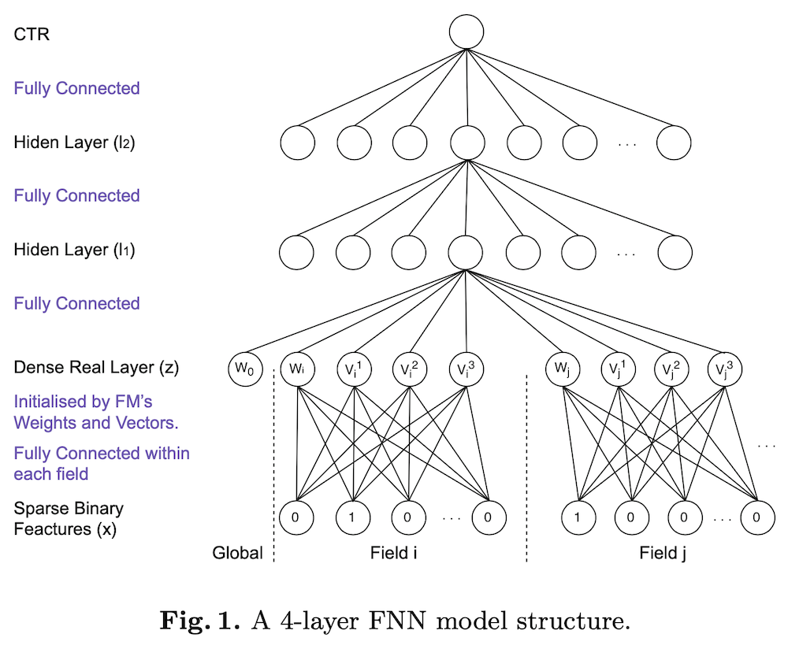
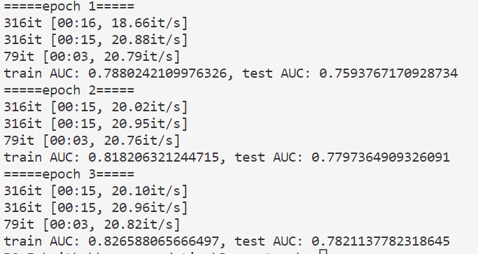
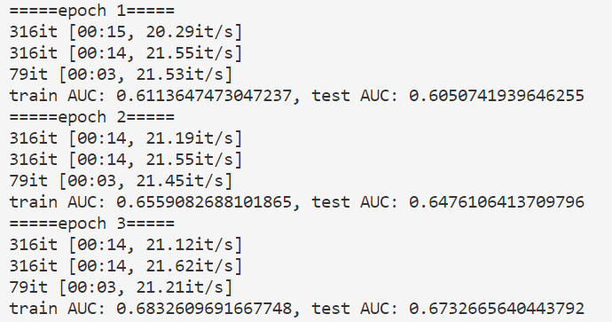
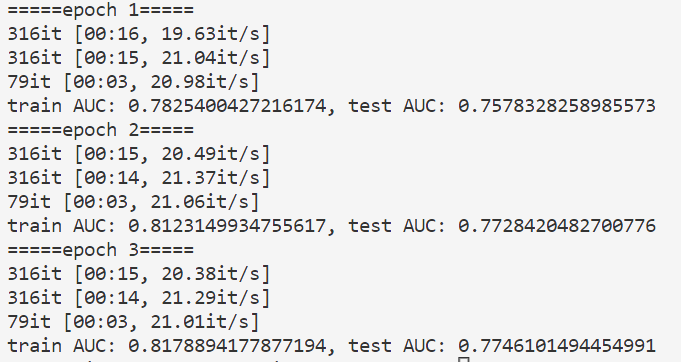

# FNN 学习笔记

FNN(Factorization Machine supported Neural Network)[^1]模型是FM模型与多层神经网络MLP的组合。该模型不是end-to-end，而是分为了两个阶段，首先通过FM预训练embedding层，而后使用训练好的embedding向量去训练MLP网络。



## Pytorch 实现
**Embedding层**
```python
class FeaturesEmbedding(torch.nn.Module):

    def __init__(self, field_dims, embed_dim):
        super().__init__()
        self.embedding = torch.nn.Embedding(sum(field_dims), embed_dim)
        self.offsets = np.array((0, *np.cumsum(field_dims)[:-1]), dtype=np.compat.long)
        # 服从均匀分布的初始化器，input必须为 tensor.float64
        torch.nn.init.xavier_uniform_(self.embedding.weight.data)

    def forward(self, x):
        """
        :param x: Long tensor of size ``(batch_size, num_fields)``
        """
        x = x + x.new_tensor(self.offsets).unsqueeze(0)
        return self.embedding(x)
```

**MLP层**
```python
class MultiLayerPerceptron(torch.nn.Module):

    def __init__(self, input_dim, embed_dims, dropout, output_layer=True):
        """_summary_
        Args:
            input_dim (int): 输入层
            embed_dims (list): 隐藏层
            dropout (float): dropout 的概率 p
            output_layer (bool, optional): 输出层是否维度为1. Defaults to True.
        """
        super().__init__()
        layers = list()
        for embed_dim in embed_dims:
            layers.append(torch.nn.Linear(input_dim, embed_dim))
            layers.append(torch.nn.BatchNorm1d(embed_dim))
            layers.append(torch.nn.ReLU())
            layers.append(torch.nn.Dropout(p=dropout))
            input_dim = embed_dim
        if output_layer:
            layers.append(torch.nn.Linear(input_dim, 1))
        self.mlp = torch.nn.Sequential(*layers)

    def forward(self, x):
        """
        :param x: Float tensor of size ``(batch_size, embed_dim)``
        """
        return self.mlp(x)
```

**FNN模型**
```python
class FactorizationSupportedNeuralNetworkModel(torch.nn.Module):
    """
    A pytorch implementation of Neural Factorization Machine.

    Reference:
        W Zhang, et al. Deep Learning over Multi-field Categorical Data - A Case Study on User Response Prediction, 2016.
    """

    def __init__(self, field_dims, embed_dim, mlp_dims, dropout):
        super().__init__()
        self.embedding = FeaturesEmbedding(field_dims, embed_dim)
        self.embed_output_dim = len(field_dims) * embed_dim
        self.mlp = MultiLayerPerceptron(self.embed_output_dim, mlp_dims, dropout)

    def forward(self, x):
        """
        :param x: Long tensor of size ``(batch_size, num_fields)``
        """
        embed_x = self.embedding(x)
        x = self.mlp(embed_x.view(-1, self.embed_output_dim))
        return torch.sigmoid(x.squeeze(1))
    
    def init_embed_from_fm(self, fm):
        embedding_param = fm.state_dict()['embedding.embedding.weight']
        state_dict = self.state_dict()
        state_dict['embedding.embedding.weight'] = embedding_param
        self.load_state_dict(state_dict)
```

## 代码实践
以MovieLens-1M数据集为样例，令rate>3的电影评分为正样本1，rate<=3的作为负样本0，分别使用FM和FNN测试得到的AUC[^3]。

假设不使用FM预训练得到的embedding向量初始化FNN的部分参数。纯FNN经过epochs=3的训练结果如下：



假设先使用FM进行epochs=3的预训练，再将训练得到的embedding参数来初始化FNN的embedding层，结果如下：
FM的训练结果为：



经过初始化embedding层后，FNN的训练结果为：



虽然经过初始化后的FNN看起来结果没有变得更好，但可能因为训练的epoch太小了，没有显著差异。可以发现的是，即使没有初始化，FNN的结果也比FM要好很多。

[^1]:[Deep Learning over Multi-field Categorical Data](https://arxiv.org/pdf/1601.02376.pdf)
[^2]:[FNN代码实践](https://github.com/wnzhang/deep-ctr)
[^3]:[我的代码实践](./Rec_pytorch/FNN_for_ml_1m.py)