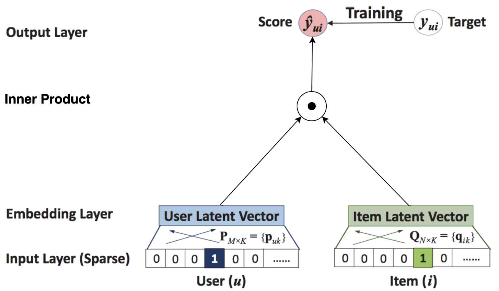
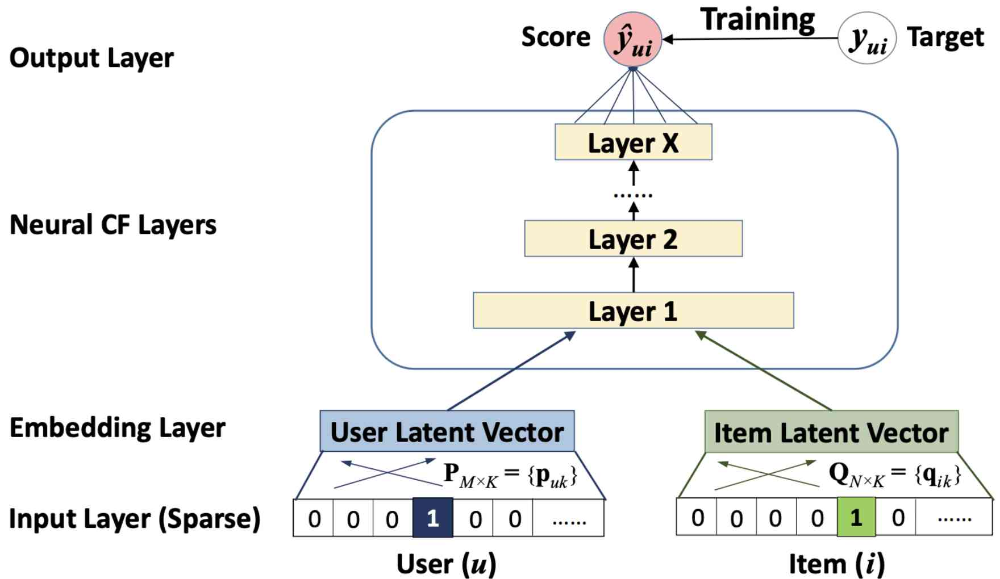
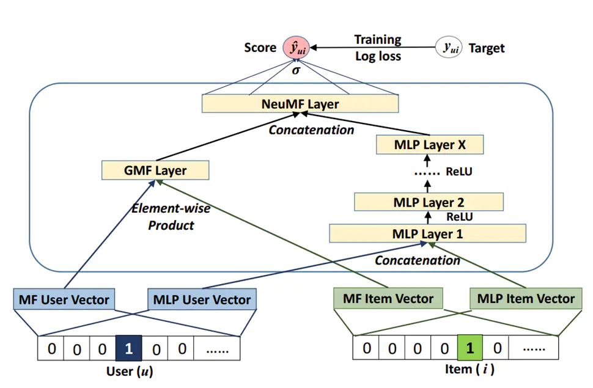

# NeuralCF 学习笔记

NeuralCF[^1]模型是传统推荐算法MF(Matrix Factorization)的改进版本，将用户向量与物品向量的内积替换为多层神经网络，使得两个向量可以进行更加深入复杂的交叉。其次，通过引入神经网络增加了非线性运算，增强了模型的表达能力。

**MF模型结构**



**NeuralCF模型结构**



可以把NCF模型作为Embedding层、MLP层和FC层的组合，根据任务的不同(二分类或多分类)，可以在最后加上Sigmoid或softmax激活函数。

**GMF+NCF模型结构**



GMF(generalized Matrix Factorization)是MF模型的另一种改进方式。其中使用哈达玛积代替内积，返回一个长度与embedding向量相同的向量参与到后续模型中。GMF与NCF的结合方式为共享用户与物品的embedding层，同时把GMF得到的向量与MLP得到的向量合并(concat)，最后加上全连接层(FC)得到一个预测概率。同样在此处可以加上softmax激活函数进行多分类预测。

## Pytorch实现

**Embedding层**
```python
class FeaturesEmbedding(torch.nn.Module):

    def __init__(self, field_dims, embed_dim):
        super().__init__()
        self.embedding = torch.nn.Embedding(sum(field_dims), embed_dim)
        self.offsets = np.array((0, *np.cumsum(field_dims)[:-1]), dtype=np.compat.long)
        # 服从均匀分布的初始化器，input必须为 tensor.float64
        torch.nn.init.xavier_uniform_(self.embedding.weight.data)

    def forward(self, x):
        """
        :param x: Long tensor of size ``(batch_size, num_fields)``
        """
        x = x + x.new_tensor(self.offsets).unsqueeze(0)
        return self.embedding(x)
```

**MLP层**
```python
class MultiLayerPerceptron(torch.nn.Module):

    def __init__(self, input_dim, embed_dims, dropout, output_layer=True):
        """_summary_
        Args:
            input_dim (int): 输入层
            embed_dims (list): 隐藏层
            dropout (float): dropout 的概率 p
            output_layer (bool, optional): 输出层是否维度为1. Defaults to True.
        """
        super().__init__()
        layers = list()
        for embed_dim in embed_dims:
            layers.append(torch.nn.Linear(input_dim, embed_dim))
            layers.append(torch.nn.BatchNorm1d(embed_dim))
            layers.append(torch.nn.ReLU())
            layers.append(torch.nn.Dropout(p=dropout))
            input_dim = embed_dim
        if output_layer:
            layers.append(torch.nn.Linear(input_dim, 1))
        self.mlp = torch.nn.Sequential(*layers)
```

**NCF模型**
```python
class NeuralCollaborativeFiltering(torch.nn.Module):
    """
    A pytorch implementation of Neural Collaborative Filtering.

    Reference:
        X He, et al. Neural Collaborative Filtering, 2017.
    """

    def __init__(self, field_dims, user_field_idx, item_field_idx, embed_dim, mlp_dims, dropout):
        super().__init__()
        self.user_field_idx = user_field_idx
        self.item_field_idx = item_field_idx
        self.embedding = FeaturesEmbedding(field_dims, embed_dim)
        self.embed_output_dim = len(field_dims) * embed_dim
        self.mlp = MultiLayerPerceptron(self.embed_output_dim, mlp_dims, dropout, output_layer=False)
        self.fc = torch.nn.Linear(mlp_dims[-1] + embed_dim, 1)

    def forward(self, x):
        """
        :param x: Long tensor of size ``(batch_size, num_user_fields)``
        """
        x = self.embedding(x)
        # 各自取出 user 和 item的特征，并将embedding平铺
        user_x = x[:, self.user_field_idx].squeeze(1)
        item_x = x[:, self.item_field_idx].squeeze(1)
        x = self.mlp(x.view(-1, self.embed_output_dim))
        gmf = user_x * item_x
        x = torch.cat([gmf, x], dim=1)
        x = self.fc(x).squeeze(1)
        return torch.sigmoid(x)
```

[^1]:[Neural Collaborative Filtering (NUS 2017).pdf](./paper/%5BNCF%5D%20Neural%20Collaborative%20Filtering%20(NUS%202017).pdf)
[^2]:[GMF+NeuralCF](https://zhuanlan.zhihu.com/p/547670875)
[^3]:[NeuralCF](https://blog.csdn.net/zhao254014/article/details/126550306)