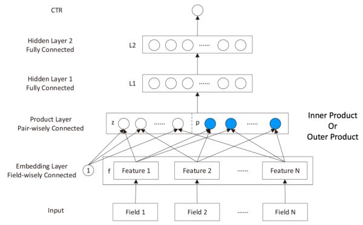

# PNN 学习笔记
PNN(Product-based Neural Networks)[^1]的结构与FNN相似，都包含有Embedding层与MLP层，不同之处在于，在将Embedding向量输入MLP之前，PNN还通过Product层进行特征交叉，可以将其看作Embedding + Product + MLP的组合。



对Embedding向量的交叉处理可以通过内积和外积进行实现。假设在下面的各个变量中含义为：
- batch_size: 每一个batch中样本的数量
- num_field: 在经过embedding前特征域的数量
- emb_dim: 对每一个特征embedding后的向量维度

**内积：** 输入Tensor形状为(batch, num_field, emb_dim)，对每一个特征所代表的embedding向量两两做内积，返回的形状为(batch, num_field*(num_field)//2)

**外积：** 输入Tensor形状为(batch, num_field, emb_dim)，embedding向量两两做外积，则可以得到 num_field*(num_field-1)//2个形状为(emb_dim, emb_dim)的矩阵。在此处对每个矩阵各分配一个同样大小的参数矩阵，对应位置元素相乘后求和，最后同样返回形状为(batch, num_field*(num_field)//2)的Tensor。

## Pytorch 实现

**内积层**

```python
class InnerProductNetwork(torch.nn.Module):

    def forward(self, x):
        """
        :param x: Float tensor of size ``(batch_size, num_fields, embed_dim)``
        returns: (batch_size, num_fields * (num_fields - 1) // 2)
        """
        num_fields = x.shape[1]
        row, col = list(), list()
        for i in range(num_fields - 1):
            for j in range(i + 1, num_fields):
                row.append(i), col.append(j)
        return torch.sum(x[:, row] * x[:, col], dim=2)
```

**外积层**

```python
class OuterProductNetwork(torch.nn.Module):

    def __init__(self, num_fields, embed_dim, kernel_type='mat'):
        super().__init__()
        num_ix = num_fields * (num_fields - 1) // 2
        if kernel_type == 'mat':
            kernel_shape = embed_dim, num_ix, embed_dim
        elif kernel_type == 'vec':
            kernel_shape = num_ix, embed_dim
        elif kernel_type == 'num':
            kernel_shape = num_ix, 1
        else:
            raise ValueError('unknown kernel type: ' + kernel_type)
        self.kernel_type = kernel_type
        self.kernel = torch.nn.Parameter(torch.zeros(kernel_shape))
        torch.nn.init.xavier_uniform_(self.kernel.data)

    def forward(self, x):
        """
        :param x: Float tensor of size ``(batch_size, num_fields, embed_dim)``
        """
        num_fields = x.shape[1]
        row, col = list(), list()
        for i in range(num_fields - 1):
            for j in range(i + 1, num_fields):
                row.append(i), col.append(j)
        p, q = x[:, row], x[:, col]     # (batch_size, num_ix, embed_dim)
        if self.kernel_type == 'mat':
            # p.unsqueeze(1)  (batch_size, 1, num_ix, embed_dim)
            # p.unsqueeze(1)*self.kernel (batch_size, embed_dim, num_ix, embed_dim)
            # torch.sum(p.unsqueeze(1) * self.kernel, dim=-1) (batch_size, embed_dim, num_ix)
            kp = torch.sum(p.unsqueeze(1) * self.kernel, dim=-1).permute(0, 2, 1) # (batch_size, num_ix, embed_dim)
            return torch.sum(kp * q, -1)    #(batch_size, num_ix)
        else:
            return torch.sum(p * q * self.kernel.unsqueeze(0), -1)
```

**PNN模型**

```python
class ProductNeuralNetworkModel(torch.nn.Module):
    """
    A pytorch implementation of inner/outer Product Neural Network.
    Reference:
        Y Qu, et al. Product-based Neural Networks for User Response Prediction, 2016.
    """

    def __init__(self, field_dims, embed_dim, mlp_dims, dropout, method='inner'):
        super().__init__()
        num_fields = len(field_dims)
        if method == 'inner':
            self.pn = InnerProductNetwork()
        elif method == 'outer':
            self.pn = OuterProductNetwork(num_fields, embed_dim)
        else:
            raise ValueError('unknown product type: ' + method)
        self.embedding = FeaturesEmbedding(field_dims, embed_dim)
        self.embed_output_dim = num_fields * embed_dim
        self.mlp = MultiLayerPerceptron(num_fields * (num_fields - 1) // 2, mlp_dims, dropout)

    def forward(self, x):
        """
        :param x: Long tensor of size ``(batch_size, num_fields)``
        """
        embed_x = self.embedding(x)
        cross_term = self.pn(embed_x)
        x = self.mlp(cross_term)
        return torch.sigmoid(x.squeeze(1))
```

[^1]:[Product-based Neural Networks for User Response
Prediction](https://arxiv.org/pdf/1611.00144.pdf)
[^2]:[PNN代码实现](https://github.com/Atomu2014/product-nets)
[^3]:[PNN模型介绍](https://zhuanlan.zhihu.com/p/267219459)
[^4]:[](https://blog.csdn.net/qq_38375203/article/details/124992147)