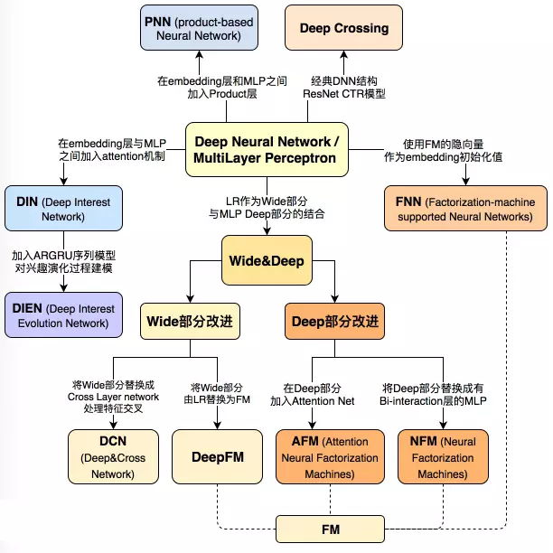

# README
该项目内容为我在学习推荐系统记录的算法总结及实现结果。

## 目录
- [AutoRec](AutoRec.md)
- [NeuralCF](NeuralCF.md)
- [FM](FM.md)
- [FNN](FNN.md)
- [PNN](PNN.md)
- [DeepCrossing](DeepCrossing.md)
- [Wide&Deep](Wide%26Deep.md)
- [DeepFM](DeepFM.md)
- [DCN](DCN.md)
## 数据集
- [KuaiRec：【快手+中科大】全曝光推荐数据集](https://kuairec.com/)
## Reference
1. [参考文献](https://github.com/wzhe06/Reco-papers)
